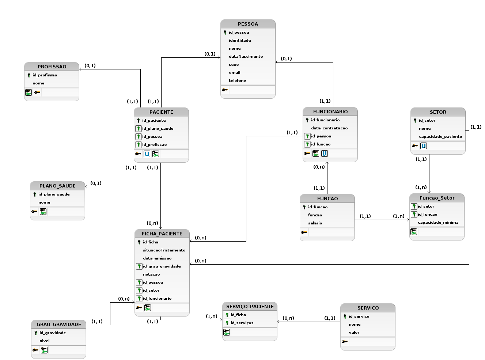

# TRABALHO 01:  Hospital Robert Rey
Trabalho desenvolvido durante a disciplina de BD1

# Sumário

<hr>

### 1. COMPONENTES<br>
Integrantes do grupo<br>
Matheus Teixeira de Aguiar : matheustxaguiar@gmail.com<br>
Jhovany Paulo Schelemberg Murgia : schelemberg_jps@hotmail.com<br>
Douglas Correa Nunes : douglasc7nunes@gmail.com<br>

<hr>

### 2.INTRODUÇÃO E MOTIVAÇÃO<br>
> O sistema tem como propósito digitalizar e apoiar as atividades realizadas pelo Hospital Robert Rey, integrando os setores, fornecendo maior agilidade e confiabilidade nas informações essenciais ao seu funcionamento, reduzindo o tempo de espera, tanto dos pacientes, quanto dos funcionários.
 
<hr>

### 3.MINI-MUNDO<br>

>O paciente que chegar no hospital Robert Rey deve passar primeiro pela recepção, se for a sua primeira vez no hospital, deve ser criado o seu cadastro (identidade, nome, idade, sexo email e telefone, profissão e se tem plano de saúde). Logo após a recepção, deve-se registrar a sua entrada e o paciente deve se dirigir ao consultório clínico geral. 
O médico clínico irá abrir uma nova ficha do paciente e preencher os seguintes dados: dados anatômicos obtidos (peso, altura e pressão), possíveis alergias a medicamentos, data do dia da consulta, quais enfermidades o paciente diz sentir e seu grau de gravidade (baseado no protocolo de Manchester), e por fim para qual médico especialista ele deve ser encaminhado. 
O especialista poderá receitar remédios, terapia, internação ou a combinação entre as opções e também pedir exames. Como em qualquer interação do paciente com o hospital, o especialista deve registrar a consulta do paciente no sistema.
Há setores de terapia no hospital, como fisioterapia, psicologia, enfermaria e UTI. Cada um desses setores têm uma capacidade máxima de atendimento, por causa disso é necessário controlar a quantidade de pacientes que estão sendo tratados por setor.
Todos os trabalhadores do hospital devem ser cadastrados com identidade, nome, idade, sexo email, telefone, data de contratação, profissão e salário. Para os trabalhadores da saúde, além da profissão, deve ser preenchida sua especialidade. A administração do hospital Robert Rey tem suas diretrizes e normas administrativas, que podem mudar ao longo do tempo, mas inicialmente está definido que cada setor do hospital tenha uma quantidade específica de profissionais para cada setor.
 
<hr>

### 4.PROTOTIPAÇÃO, PERGUNTAS A SEREM RESPONDIDAS E TABELA DE DADOS<br>
#### 4.1 RASCUNHOS BÁSICOS DA INTERFACE (MOCKUPS)<br>
O protótico foi desenvolvido usando a plataforma: https://balsamiq.com/products/mockups/<br>


#### 4.2 QUAIS PERGUNTAS PODEM SER RESPONDIDAS COM O SISTEMA PROPOSTO?

> O hospital Robert Rey precisa inicialmente dos seguintes relatórios:
* Relatório que obtenha o número de pacientes no hospital.
* Relatório que exponha quantos funcionários há no hospital.
* Relatório refetente ao nome do funcionário, setor que trabalha e respectiva função e salário, bem como a média salarial desse setor.
* Relatório que mostre o número corrente de pacientes em tratamento no hospital de acordo com o setor e apresente de forma decrescente os setores mais usados.
* Relatório contendo o valor total ganho em cada tipo de serviço prestado, bem como o a quantidade utilizada destes.
* Relatório que mostre o nome do paciente e o valor total a pagar pelos serviços utilizados.
* Relatório sobre a média salarial e desvio padrão do salário dos funcionários funcionários.
* Relatório que informe o número de funcionários alocados por setor.
* Relatório relativo ao número de pacientes por setor.
* Relatório exponto dos serviços mais usados pelos pacientes.
* Relatório informando o plano de saúde mais utilizado pelos pacientes.

#### 4.3 TABELA DE DADOS DO SISTEMA:

[Exemplo de Tabela de dados do Hospital Robert Rey](https://docs.google.com/spreadsheets/d/1kBO0NiIk8IBr1KOPoygR_vm81mIjuepTbDXm-eZXArY/edit?usp=sharing "Tabela - Hospital Robert Rey")
 
<hr>
    
### 5.MODELO CONCEITUAL<br>


#### 5.1 Validação do Modelo Conceitual
    [Grupo01]: Carlos Breno, Clebes Salustiano e Éllen Neves; 
    [Grupo02]: Arthur Delpupo, Guilherme Bleidão e Thiago; 

#### 5.2 Descrição dos dados<br>
  **PESSOA:** tabela que armazena os dados pessoais dos clientes e funcionários cadastrados no sistema.
  - id_pessoa: campo que armazena identificador usado para cada pessoa no sistema;
  - identidade: campo que armazena o número do RG de cada pessoa no sistema;
  - nome: campo que armazena o nome completo de cada pessoa no sistema;
  - sexo: campo que armazena o sexo relativo de cada pessoa no sistema;
  - data_nascimento: campo que armazena a data de nascimento de cada pessoa no sistema;
  - email: campo que armazena o email de cada pessoa registrada no sistema;
  - telefone: campo que armazena o número de telefone de cada pessoa registrada no sistema.
 
 <br><br>

 **FUNÇÃO:** tabela que armazena as funções que os funcionários podem exercer no hospital com seu respectivo salário.
 - id_função: campo que armazena o identificador de cada função registrada no sistema;
 - funcao: campo que armazena o nome de cada função;
 - salario: campo que armazena o valor do salário relativo a cada função.
 
 <br><br>

 **PACIENTE:** tabela que armazena informações específicas em relação aos pacientes.
 - id_paciente: campo que armazena o identificador de cada paciente;
 - id_pessoa: campo que armazena o identificador da pessoa que é também um paciente.

  <br><br>
  
 **PROFISSAO:** tabela que armazena as profissões dos pacientes.
 - id_profissao: campo que armazena o identificador da profissao;
 - nome: campo que armazena a nome da profissão;

  <br><br>
  
 **PLANO_SAUDE:** tabela que armazena os planos de saúde abrangidos pelo hospital Robert Rey.
 - id_plano_saude: campo que armazena o identificador do plano de saude;
 - nome: campo que armazena o nome plano de saúde;
 
 <br><br>

 **SETOR:** tabela que armazena as informações relativas ao setores do hospital.
 - id_setor: campo que armazena o identificador de cada setor;
 - nome: campo que armazena o nome de cada setor;
 - capacidade_paciente: campo que armazena a capacidade máxima de pacientes que o setor suporta.

 <br><br>

 **FUNCIONÁRIO:** tabela que armazena informações específicas em relação aos funcionários.
 - id_funcionario: campo que armazena o identificador de cada funcionário registrado no sistema;
 - data_contratacao: campo que armazena a data de contratação do funcionário;
 - id_pessoa: campo que armazena o identificador de uma pessoa que também é funcionário;
 - id_funcao: campo que armazena o identificador da função exercida por este funcionário.

 <br><br>

 **FICHA_PACIENTE:** tabela que armazena as informações relativas ao tratamento recebido pelos pacientes.
 - id_ficha: campo que armazena o identificador da ficha de cada paciente;
 - situacao_tratamento: campo que armazena a situação do tratamento que o paciente está recebendo, por exemplo, se o tratamento está em  andamento ou o paciente já recebeu alta; 
 - data_emissao: campo que armazena a data de criação da ficha;
 - grau_gravidade: campo que armazena o grau de gravidade da enfermidade que sta sendo tratada no paciente;
 - notacao: campor que armazena uma breve descrição da situação do paciente;
 - id_pessoa: campo que armazena o identificador da pessoa que é paciente;
 - id_setor; campo que armazena o identificador do setor onde o paciente está sendo tratado;
 - id_funcionario: campo que armazena o identificador do funcionário responsável pelo tratamento no qual o paciente está sendo submetido.

  <br><br>
  
 **GRAU_GRAVIDADE:** tabela que os níveis de gravidade dos pacientes.
 - id_gravidade: campo que armazena o identificador da gravidade;
 - nivel: campo que armazena o grau de gravidade da enfermidade que sta sendo tratada no paciente;
 
 <br><br>

 **SERVICO:** tabela que armazena informações relativas aos serviços que o hospital oferece.
 - id_serivco: campo que armazena o identificador de cada serviço cadastrado no sistema;
 - nome: campo que armazena o nome do serviço;
 - valor: campo que armazena o valor do serviço.
 
 <br><br>

 **PACIENTE_SERVICO:** tabela que relaciona o paciente aos serviços utilizados por ele.
 - id_ficha; campo que armazena o identificador da ficha do paciente;
 - id_servico: campo que armazena o identificador do serviço prestado a esse paciente;
 - data_servico: campo que armazena a data em que o serviço foi prestado.
 
 <br><br>

 **FUNCAO_SETOR:** tabela que relaciona os setores e as funções dos funcionários que ele necessita para funcionar. 
 - id_setor: campo que armazena o identificador do setor;
 - id_funcao: campo que armazena o identificador da função que atua no setor;
 - min_capacidade: campo que armazena a quantidade mínima de profissionais da função necessárias para o funcionamento do setor. 

<hr>

### 6	MODELO LÓGICO<br>



 
<hr>

### 7	MODELO FÍSICO<br>

```sql
CREATE TABLE Pessoa(id_pessoa int PRIMARY KEY,
                       identidade bigint,
                       nome varchar(50),
                       data_nascimento date,
                       sexo varchar(10),
                       email varchar(50),
                       telefone bigint);


CREATE TABLE Profissao(id_profissao int PRIMARY KEY,
                       nome varchar(50));                    


CREATE TABLE Plano_Saude(id_plano_saude int PRIMARY KEY,
                       nome varchar(50));   


CREATE TABLE Paciente(id_paciente int PRIMARY KEY,
                     id_pessoa int,
                     id_plano_saude int,
                     id_profissao int,
                     FOREIGN KEY(id_plano_saude)
                     REFERENCES Plano_Saude(id_plano_saude),
                     FOREIGN KEY(id_profissao)
                     REFERENCES Profissao(id_profissao),
                     FOREIGN KEY(id_pessoa)
                     REFERENCES Pessoa(id_pessoa));                


CREATE TABLE Funcao(id_funcao int PRIMARY KEY,
                    funcao varchar(20),
                    salario real);
 
 
CREATE TABLE Funcionario(id_funcionario int PRIMARY KEY,
                        data_contratacao date,
                        id_pessoa int,
                        id_funcao int,
                        FOREIGN KEY(id_pessoa)
                        REFERENCES Pessoa(id_pessoa),
                        FOREIGN KEY(id_funcao)
                        REFERENCES Funcao(id_funcao));


CREATE TABLE Setor(id_setor int PRIMARY KEY,
                   nome varchar(20),
                   capacidade_paciente int);


CREATE TABLE Grau_Gravidade(id_gravidade int PRIMARY KEY,
                       nivel varchar(50)); 
 
 
CREATE TABLE Ficha_Paciente(id_ficha int PRIMARY KEY,
                            situacao_tratamento varchar(20),
                            data_emissao date,
                            notacao varchar(150),
                            id_pessoa int,
                            id_setor int,
                            id_funcionario int,
                            id_grau_gravidade int,
                            FOREIGN KEY(id_pessoa)
                            REFERENCES Pessoa(id_pessoa),
                            FOREIGN KEY(id_setor)
                            REFERENCES Setor(id_setor),
                            FOREIGN KEY(id_funcionario)
                            REFERENCES Funcionario(id_funcionario),
                            FOREIGN KEY(id_grau_gravidade)
                            REFERENCES Grau_Gravidade(id_gravidade));


CREATE TABLE Funcao_Setor(id_setor int,
                            id_funcao int,
                              min_capacidade int,
                            FOREIGN KEY(id_setor)
                            REFERENCES Setor(id_setor),
                            FOREIGN KEY(id_funcao)
                            REFERENCES Funcao(id_funcao));


CREATE TABLE Servico(id_servico int PRIMARY KEY,
                     nome varchar(40),
                     valor real);


CREATE TABLE Paciente_Servico(id_ficha int,
                              id_servico int,
                                data_servico date,
                              FOREIGN KEY(id_ficha)
                              REFERENCES Ficha_Paciente(id_ficha),
                              FOREIGN KEY(id_servico)
                              REFERENCES Servico(id_servico))
```

<hr>

### 8	INSERT APLICADO NAS TABELAS DO BANCO DE DADOS<br>

```sql
INSERT INTO Pessoa (id_pessoa, identidade, nome, data_nascimento, sexo, email, telefone)
    VALUES (0001, 12345678912, 'Vinícius Barbosa', '1977-03-21', 'Masculino', 'vinicius22@gmail.com', 27999999999),
           (0002, 98765432198, 'Márcia Monteiro', '1993-02-11', 'Feminino', 'marcia_m@hotmail.com', 28999990000),
           (0003, 14725836914, 'Ricardo Justo', '2000-09-10', 'Masculino', 'ricardo_justo3@hotmail.com', 27912345678),
           (0004, 96385274196, 'Heloísa Cunha', '1939-09-06', 'Feminino', 'heloisaconha39@outlook.com', 27999000999),
           (0005, 75324186952, 'Vivian Pinheiro', '1988-01-30', 'Feminino', 'vivi_pinheiro_oficial@gmail.com', 27987654321),
           (0006, 11122233344, 'Arthur D', '1950-03-24', 'Masculino', 'arthurd22@gmail.com', 27999991000),
           (0007, 93405834590, 'Guilherme B', '1980-11-01', 'Masculino', 'guilherminho__vix@hotmail.com', 27999667070),
           (0008, 77777451252, 'Lewis Hamilton', '1978-01-04', 'Masculino', 'lewishamilton44@gmail.com', 11998880033),
           (0009, 44334354566, 'Jô soares', '1960-2-20', 'Masculino', 'jojoamoglobo@outlook.com.br', 28987452233),
           (0010, 00000000001, 'Sharika Colombia', '2000-09-17', 'Feminino', 'wakawka_oficial@gmail.com', 11987666000),
           (0011, 12523658778, 'Harry Potter', '1993-07-01', 'Masculino', 'harrypotter_bruxo@gmail.com', 28998877665),
           (0012, 99887766554, 'Estefano estefane', '1999-01-01', 'Masculino', 'este7estafano@hotmail.com', 27999777444),
           (0013, 77777451252, 'Gabriel Barbosa', '2001-08-10', 'Masculino', 'gabigol_flamengo@gmail.com', 11912445023),
           (0014, 96385274196, 'Maria Bonita', '1958-09-20', 'Feminino', 'mariabonita@outlook.com.br', 28999333888),
           (0015, 00220011002, 'Fatima Bernades', '1977-11-20', 'Feminino', 'fatimadaglobo@gmail.com', 119584120325),
           (0016, 11122245120, 'Isabela Fonseca', '1988-07-07', 'Feminino', 'isaisafonseca@hotmail.com', 27965632325),
           (0017, 74545123595, 'Fernando Fernandez', '1983-11-12', 'Masculino', 'fffernandez@gmail.com', 11988854412),
           (0018, 55429001245, 'Thanos da Silva', '1974-03-11', 'Masculino', 'thanosdosavengers@gmail.com', 27988844211,
           (0019, 00110022003, 'Gabriela Fagundez', '1986-05-04', 'Feminino', 'gabrielafagundez@gmail.com', 11985422223),
           (0020, 96385274196, 'Debora martins', '2002-10-29', 'Feminino', 'm2002debora@outlook.com.br', 28999333888),
           (0021, 88888000088, 'Macleusa Rasputin', '1970-08-18', 'Feminino', 'macleusasouza@outlook.com.br', 11988885556);


INSERT INTO Paciente (id_paciente, id_profissao, id_plano_saude, id_pessoa)
    VALUES (0001, 0001, 0001, 0001),
           (0002, 0002, 0002, 0002),
           (0003, 0003, 0003, 0003),
           (0004, 0004, 0004, 0004),
           (0005, 0005, 0005, 0005),
           (0006, 0006, 0001, 0006),
           (0007, 0007, 0003, 0007),
           (0008, 0008, 0001, 0008),
           (0009, 0009, 0005, 0009),
           (0010, 0010, 0001, 0010),
           (0011, 0011, 0001, 0011),
           (0012, 0012, 0004, 0012),
           (0013, 0013, 0001, 0013),
           (0014, 0014, 0003, 0014),
           (0015, 0015, 0001, 0015);


INSERT INTO Ficha_Paciente (id_ficha,situacao_tratamento, data_emissao, id_grau_gravidade,notacao, id_pessoa,id_setor,id_funcionario)
    VALUES (0001,'Em Tratamento','2022-05-09', 0001,'Paciente febril e com colicas', 0001,0005,0002),
           (0002,'Alta', '2022-08-23', 0002,'Paciente relata que esta com dor na junta', 0002,0005,0002),
           (0003,'Em Tratamento', '2022-01-08', 0003,'Paciente com diarreia e vomito', 0003,0005,0002),
           (0004,'Em Tratamento', '2022-09-20', 0004,'Paciente gosta de Matematica Discreta', 0004,0006,0005),
           (0005,'Alta', '2022-11-23', 0003,'Paciente relata que caiu de moto, mas ta de boa', 0005,0004,0005),
	   (0006,'Em Tratamento','2022-01-14', 0001,'Paciente febril com diarreia', 0006,0005,0004),
           (0007,'Alta', '2022-09-23', 0002,'Sindrome do pato', 0007,0004,0004),
           (0008,'Em Tratamento', '2022-07-23', 0003,'Paciente com tremedeira', 0008,0006,0004),
           (0009,'Em Tratamento', '2022-07-15', 0004,'Paciente com mudança no paladar', 0009,0006,0005),
           (0010,'Alta', '2022-12-20', 0003,'Paciente relata que está com dor nas juntas, mas ta de boa', 0010,0006,0005),
           (0011,'Em Tratamento','2022-10-23', 0001,'Paciente com COVID', 0011,0005,0002),
           (0012,'Alta', '2022-05-23', 0002,'Paciente com Gripe forte', 0012,0005,0002),
           (0013,'Em Tratamento', '2022-07-14', 0003,'Chegou com dor no abdomem', 0013,0006,0004),
           (0014,'Em Tratamento', '2022-06-11', 0004,'Paciente gosta da Linguagem C', 0014,0006,0005),
           (0015,'Alta', '2022-01-10', 0003,'Paciente com coloração pálida e suando frio', 0015,0005,0002);


INSERT INTO Funcionario (id_funcionario, data_contratacao, id_pessoa, id_funcao)
    VALUES (0001,'2022-05-07', 0017, 0001),
           (0002, '2022-05-07', 0018, 0002),
           (0003, '2022-05-07', 0019, 0003),
           (0004, '2022-05-07', 0020, 0004),
           (0005, '2022-05-07', 0021, 0005);


INSERT INTO Funcao (id_funcao, funcao, salario)
    VALUES (0001, 'Enfermeiro', 3500.00),
           (0002, 'Médico Clinico Geral', 10000.00),
           (0003, 'Recepcionista', 2000.00),
           (0004, 'Obstetra', 3700.00),
           (0005, 'Médico Pedriatra', 6000.00),
           (0006, 'Zelador', 900.00),
           (0007, 'Analista', 10000.00),
           (0008, 'Médico otorrino', 7500.00),
           (0009, 'Médico oftamologista', 8000.00),
           (0010, 'Médico cardiologista', 20000.00);


INSERT INTO Setor (id_setor, nome, capacidade_paciente)
    VALUES (0001, 'Enfermaria A', 25),
           (0002, 'Enfermaria B', 25),
           (0003, 'UTI', 20),
           (0004, 'Centro Cirúrgico', 10),
           (0005, 'Ambulatórior', 10),
           (0006, 'Pronto socorro', 100),
           (0006, 'Especialidade', 100),
           (0006, 'Terapia', 100);


INSERT INTO Servico (id_servico, nome, valor)
    VALUES (0001, 'Eletrocardiogram', 100.00),
           (0002, 'Ecocardiografia transtorácica', 150.00),
           (0003, 'Eletroencefalograma', 100.00),
           (0004, 'Mamografia', 200.00),
           (0005, 'Radiografia', 50.00),
           (0006, 'Radiografia Contraste', 75.00),
           (0007, 'Tomografia', 210.00),
           (0008, 'Ultrasonografia simples', 200.00),
           (0009, 'Ultrasonografia com Doppler', 260.00); 


INSERT INTO Paciente_Servico (id_ficha, id_servico, data_servico)
    VALUES (0001, 0001, '2022-01-13'),
           (0002, 0002, '2022-10-23'),
           (0003, 0003, '2022-01-19'),
           (0004, 0004, '2022-06-08'),
           (0005, 0005, '2022-05-05'),
           (0001, 0007, '2022-10-04'),
           (0002, 0004, '2022-12-19'),
           (0003, 0009, '2022-11-14'),
           (0004, 0005, '2022-09-13'),
           (0005, 0008, '2022-05-17');
        

INSERT INTO Funcao_Setor (id_setor, id_funcao, min_capacidade)
    VALUES (0001, 0001, 10),
           (0001, 0002, 1),
           (0002, 0001, 18),
           (0005, 0003, 4),
           (0005, 0002, 3),
           (0001, 0006, 3),
           (0006, 0001, 18),
           (0006, 0006, 4),
           (0006, 0008, 3),
           (0006, 0009, 3),
           (0006, 0009, 3),      


INSERT INTO Profissao (id_profissao, nome)
    VALUES (0001, 'professor'),
           (0002, 'mecanico'),
           (0003, 'estudante'),
           (0004, 'mestre de obras'),
           (0005, 'designer'),
           (0006, 'professor'),
           (0007, 'mecanico'),
           (0008, 'estudante'),
           (0009, 'mestre de obras'),
           (0010, 'designer'),
           (0011, 'carpinteiro'),
           (0012, 'pedreiro'),
           (0013, 'padre'),
           (0014, 'estudante'),
           (0015, 'desempregado');


INSERT INTO Plano_Saude (id_plano_saude, nome)
    VALUES (0001, 'Unimed'),
           (0002, 'Medsenior'),
           (0003, 'SAMP'),
           (0004, 'Sul America'),
           (0005, 'nenhum');


INSERT INTO Grau_Gravidade (id_gravidade, nivel)
    VALUES (0001, 'nao urgente'),
           (0002, 'pouco urgente'),
           (0003, 'urgente'),
           (0004, 'muito urgente');
```
[Inserts Aplicados nas Tabelas](arquivos/inserts_aplicados.sql "Insert Aplicado nas Tabelas")

<hr>

### 9	TABELAS E PRINCIPAIS CONSULTAS<br>

#### 9.1	CONSULTAS DAS TABELAS COM TODOS OS DADOS INSERIDOS (Todas) <br>

[Colab Consulta dos Dados Inseridos - Hospital Robert Rey](https://colab.research.google.com/drive/11GeHO5oMvWhBsLwqPevf8lK17uPUco-o?usp=sharing)

<br>
<br>


># Marco de Entrega 01: Do item 1 até o item 9.1<br>
#### Segue abaixo o link do Colab com os itens 9.1 à 9.10<br>
[Colab Consulta dos Itens 9.1 à 9.10 - Hospital Robert Rey](https://colab.research.google.com/drive/11GeHO5oMvWhBsLwqPevf8lK17uPUco-o?usp=sharing)

#### 9.2	CONSULTAS DAS TABELAS COM FILTROS WHERE (Mínimo 4)<br>
#### 9.3	CONSULTAS QUE USAM OPERADORES LÓGICOS, ARITMÉTICOS E TABELAS OU CAMPOS RENOMEADOS (Mínimo 11)
    a) Criar 5 consultas que envolvam os operadores lógicos AND, OR e Not
    b) Criar no mínimo 3 consultas com operadores aritméticos 
    c) Criar no mínimo 3 consultas com operação de renomear nomes de campos ou tabelas

#### 9.4	CONSULTAS QUE USAM OPERADORES LIKE E DATAS (Mínimo 12) <br>
    a) Criar outras 5 consultas que envolvam like ou ilike
    b) Criar uma consulta para cada tipo de função data apresentada.

#### 9.5	INSTRUÇÕES APLICANDO ATUALIZAÇÃO E EXCLUSÃO DE DADOS (Mínimo 6)<br>
    a) Criar minimo 3 de exclusão
    b) Criar minimo 3 de atualização

#### 9.6	CONSULTAS COM INNER JOIN E ORDER BY (Mínimo 6)<br>
    a) Uma junção que envolva todas as tabelas possuindo no mínimo 2 registros no resultado
    b) Outras junções que o grupo considere como sendo as de principal importância para o trabalho

#### 9.7	CONSULTAS COM GROUP BY E FUNÇÕES DE AGRUPAMENTO (Mínimo 6)<br>
    a) Criar minimo 2 envolvendo algum tipo de junção

#### 9.8	CONSULTAS COM LEFT, RIGHT E FULL JOIN (Mínimo 4)<br>
    a) Criar minimo 1 de cada tipo

#### 9.9	CONSULTAS COM SELF JOIN E VIEW (Mínimo 6)<br>
        a) Uma junção que envolva Self Join (caso não ocorra na base justificar e substituir por uma view)
        b) Outras junções com views que o grupo considere como sendo de relevante importância para o trabalho

#### 9.10	SUBCONSULTAS (Mínimo 4)<br>
     a) Criar minimo 1 envolvendo GROUP BY
     b) Criar minimo 1 envolvendo algum tipo de junção

># Marco de Entrega 02: Do item 9.2 até o ítem 9.10<br>

### 10 RELATÓRIOS E GRÁFICOS
#### Segue abaixo o link do Colab com os Relatórios em forma gráfica<br>
[Colab Consulta do Item 10- Hospital Robert Rey](https://colab.research.google.com/drive/11GeHO5oMvWhBsLwqPevf8lK17uPUco-o?usp=sharing)

#### a) análises e resultados provenientes do banco de dados desenvolvido (usar modelo disponível)


#### Relatório 1<br>
Objetivo: Relatório refente a capacidade máxima suportada por um setor e a quantidade corrente de pacientes ali presentes.
<p align="center">
  
</p>

<hr>

#### Relatório 2<br>
Objetivo: Relatório informando o plano de saúde mais utilizado pelos pacientes.
<p align="center">
  
</p>

<hr>

#### Relatório 3<br>
Objetivo: Relatório contendo a receita total ganha por procedimento no hospital.
<p align="center">
  
</p>

<hr>

#### Relatório 4<br>
Objetivo: Verificar a média salarial dos homens e das mulheres.
<p align="center">
  
</p>

<hr>

#### Relatório 5<br>
Objetivo: Relatório referente a média salarial de um setor.
<p align="center">
  
</p>
 
<hr>

### 11	AJUSTES DA DOCUMENTAÇÃO, CRIAÇÃO DOS SLIDES E VÍDEO PARA APRESENTAÇAO FINAL <br>

#### a) Modelo (pecha kucha)<br>
#### b) Tempo de apresentação 6:40 

># Marco de Entrega 03: Itens 10 e 11<br>
<br>
<br>
<br> 


### 12 FORMATACAO NO GIT:<br> 
https://help.github.com/articles/basic-writing-and-formatting-syntax/
<comentario no git>
    
##### About Formatting
    https://help.github.com/articles/about-writing-and-formatting-on-github/
    
##### Basic Formatting in Git
    
    https://help.github.com/articles/basic-writing-and-formatting-syntax/#referencing-issues-and-pull-requests
    
    
##### Working with advanced formatting
    https://help.github.com/articles/working-with-advanced-formatting/
#### Mastering Markdown
    https://guides.github.com/features/mastering-markdown/

    
### OBSERVAÇÕES IMPORTANTES

#### Todos os arquivos que fazem parte do projeto (Imagens, pdfs, arquivos fonte, etc..), devem estar presentes no GIT. Os arquivos do projeto vigente não devem ser armazenados em quaisquer outras plataformas.
1. <strong>Caso existam arquivos com conteúdos sigilosos<strong>, comunicar o professor que definirá em conjunto com o grupo a melhor forma de armazenamento do arquivo.

#### Todos os grupos deverão fazer Fork deste repositório e dar permissões administrativas ao usuário do git "profmoisesomena", para acompanhamento do trabalho.

#### Os usuários criados no GIT devem possuir o nome de identificação do aluno (não serão aceitos nomes como Eu123, meuprojeto, pro456, etc). Em caso de dúvida comunicar o professor.


Link para BrModelo:<br>
http://www.sis4.com/brModelo/download.html
<br>


Link para curso de GIT<br>


